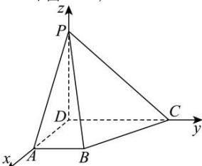

> [!faq]- 全练一本通解析
> **【答案】** （1）证明见解析（2） $-\frac{\sqrt{2}}{2}$
>
> **【解析】**
> （1）因为 $AB//CD$ ， $\angle ADC = 90^{\circ}$ ，所以 $AB\bot AD$ 又因为平面PAD⊥平面ABCD，且平面PAD∩平面ABCD=AD， $AB\subset$ 平面ABCD，所以 $AB\bot$ 平面PAD：
> (2)
> 
> 因为 DP, DA, DC 两两垂直,
> 以 D 为原点, DA, DC, DP 为 x, y, z 轴正方向建系, 如图所示:
> 所以 $A(2,0,0)$ , $B(2,1,0)$ , $C(0,2,0)$ , $P(0,0,2)$ ,
> 所以 $\overrightarrow{AP}=(-2,0,2),\overrightarrow{PB}=(2,1,-2),\overrightarrow{PC}=(0,2,-2)$ 设平面 PAB 的法向量 $\vec{m}=(x_{1},y_{1},z_{1})$ ，则 $\left\{\begin{aligned}\vec{m}\cdot\overrightarrow{AP}&=0\\ \vec{m}\cdot\overrightarrow{PB}&=0\end{aligned}\right.$ ，即 $\left\{\begin{aligned}-2x_{1}+2z_{1}&=0\\ 2x_{1}+y_{1}-2z_{1}&=0\end{aligned}\right.$ 令 $x_{1}=1$ ，则法向量可取 $\vec{m}=(1,0,1)$ ，
> 同理设平面 PBC 法向量 $\vec{n}=(x_{2},y_{2},z_{2})$ 则 $\left\{\begin{aligned}\vec{n}\cdot\overrightarrow{PC}&=0\\ \vec{n}\cdot\overrightarrow{PB}&=0\end{aligned}\right.\left\{\begin{aligned}2y_{2}-2z_{2}&=0\\ 2x_{2}+y_{2}-2z_{2}&=0\end{aligned}\right.$ 令 $y_{2}=1$ ，则法向量可取 $\vec{n}=\left(\frac{1}{2},1,1\right)$ 所以 $\cos<\vec{m},\vec{n}>=\frac{\vec{m}\cdot\vec{n}}{|\vec{m}||\vec{n}|}=\frac{\frac{1}{2}\times1+1}{\sqrt{2}\times\sqrt{\frac{1}{4}+1+1}}=\frac{\sqrt{2}}{2}$ 又 $<\vec{m},\vec{n}>[0,\pi]$ ，且观察可得二面角 A-PB-C 所成的平面角为钝角，
> 所以二面角 A-PB-C 的余弦值为 $-\frac{\sqrt{2}}{2}$ .
