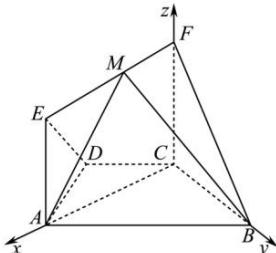

> [!faq]- 全练一本通解析
> **【答案】** （1）证明见解析；（2） $\cos\theta\in\left[\frac{\sqrt{7}}{7},\frac{1}{2}\right]$ .
>
> **【解析】**
> （1）证明：在四边形 ABCD 中，
> 因为 AB // CD，AD = DC = CB = 1， $\angle ABC = 60^{\circ}$ ，
> 所以四边形 ABCD 是等腰梯形，且 $\angle DCA = \angle DAC = 30^{\circ}$ ， $\angle DCB = 120^{\circ}$ ，
> 所以 $\angle ACB = \angle DCB - \angle DCA = 90^{\circ}$ ， $AC \perp BC$ ；
> 又因为平面 ACFE ⊥ 平面 ABCD，交线为 AC，
> 所以 BC ⊥ 平面 ACFE.
> 又因为 BC ⊥ 平面 ACFE，所以平面 FBC ⊥ 平面 ACFE.
> （2）分别以直线 CA，CB，CF 为 x，y，z 轴建立如图所示的空间直角坐标系.
> 
> 设 $\left|\overrightarrow{FM}\right|=\lambda\left(0\leq\lambda\leq\sqrt{3}\right)$ ,
> 则 $C(0,0,0)$ ， $A(\sqrt{3},0,0)$ ， $B(0,1,0)$ ， $M(\lambda,0,1)$ ，
> 所以 $\overrightarrow{AB}=\left(-\sqrt{3},1,0\right)$ ， $\overrightarrow{BM}=\left(\lambda,-1,1\right)$ 设平面 ABM 的法向量为 $\vec{\mu}=(x,y,z)$ 则 $\left\{\begin{aligned}\bar{\mu}\cdot\overline{AB}&=0\\ \bar{\mu}\cdot\overline{BM}&=0\end{aligned}\right.$ ，即 $\left\{\begin{aligned}-\sqrt{3}x+y&=0\\ \lambda x-y+z&=0\end{aligned}\right.$ 令 x=1，则 $\vec{\mu}=\left(1,\sqrt{3},\sqrt{3}-\lambda\right)$ 因为 $\vec{\nu}=(1,0,0)$ 是平面 FCB 的一个法向量，
> 所以 $\cos\theta=\frac{\vec{\mu}\cdot\vec{\nu}}{\left|\vec{\mu}\right|\cdot\left|\vec{\nu}\right|}=\frac{1}{\sqrt{1+3+\left(\sqrt{3}-\lambda\right)^{2}}}=\frac{1}{\sqrt{\left(\lambda-\sqrt{3}\right)^{2}+4}}$ 因为 $0 \leq \lambda \leq \sqrt{3}$ ，所以当 $\lambda = 0$ 时， $\cos\theta$ 有最小值，最小值为 $\frac{\sqrt{7}}{7}$ .
> 当 $\lambda=\sqrt{3}$ 时， $\cos\theta$ 有最大值，最小值为 $\frac{1}{2}$ ，故 $\cos\theta\in\left[\frac{\sqrt{7}}{7},\frac{1}{2}\right]$ .
