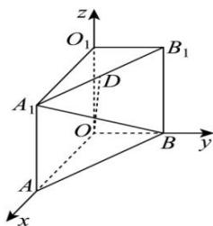

<!-- question-source:start -->
【4】（2024·全国高二专题）直三棱柱 $ABO-A_{1}B_{1}O_{1}$ 中， $\angle AOB=\frac{\pi}{2}$ ，AO=4, BO=2, $AA_{1}=4$ ，D 为 $A_{1}B_{1}$ 的中点，在如图所示的空间直角坐标系中， $\overrightarrow{DO},\overrightarrow{A_{1}B}$ 的坐标分别为 \_\_\_\_.

<!-- question-source:end -->

![[Q00005401A1]]
