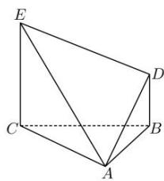

<!-- question-source:start -->
【17】如图所示, $\triangle ABC$ 是一个正三角形, $EC \perp$ 平面 ABC, BD//CE, 且 CE = CA = 2BD = 2, M 为 AE 的中点. 请建立适当空间直角坐标系, 并求各个点的坐标.

<!-- question-source:end -->

![[Q00005414A1]]
