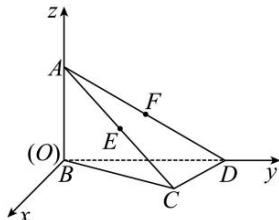

<!-- question-source:start -->
【18】如图, 点 $A(0,0,a)$ , 在四面体 ABCD 中, $AB \perp$ 平面 BCD, BC = CD, $\angle BCD = 90^{\circ}$ , $\angle ADB = 30^{\circ}$ , E, F 分别是 AC, AD 的中点, 求点 D, C, E, F 的坐标.

<!-- question-source:end -->

![[Q00005415A1]]
