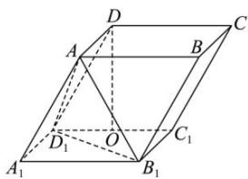

<!-- question-source:start -->
【21】平行六面体 $ABCD - A_{1}B_{1}C_{1}D_{1}$ 中, 底面 ABCD 是矩形, AB = 4, AD = 2, 平行六面体高为 $2\sqrt{3}$ , 顶点 D 在底面 $A_{1}B_{1}C_{1}D_{1}$ 的射影 O 是 $C_{1}D_{1}$ 中点, 建立适当空间直角坐标系并写出 $A_{1}, B_{1}, A, D_{1}, B$ 的坐标.

<!-- question-source:end -->

![[Q00005418A1]]
