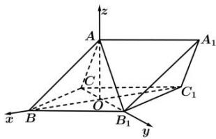

<!-- question-source:start -->
【22】三棱柱 $ABC-A_{1}B_{1}C_{1}$ 中，侧面 $BB_{1}C_{1}C$ 是边长为 2 的菱形， $\angle CBB_{1}=60^{\circ}$ ， $BC_{1}$ 交 $B_{1}C$ 于点 O， $AO\perp$ 侧面 $BB_{1}C_{1}C$ ，且 $\triangle AB_{1}C$ 为等腰直角三角形，若建立如图所示的空间直角坐标系 O-xyz，求点 $A_{1}$ 的坐标.

<!-- question-source:end -->

![[Q00005419A1]]
