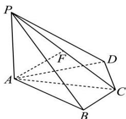

<!-- question-source:start -->
【23】如图, 四棱锥 P-ABCD 中, $PA \perp$ 底面 ABCD, $PA = BC = CD = 2$ , AC = 4, $\angle ACB = \angle ACD = \frac{\pi}{3}$ , F 为 PC 的中点. 请建立适当空间直角坐标系, 并求各个点的坐标.

<!-- question-source:end -->

![[Q00005420A1]]
