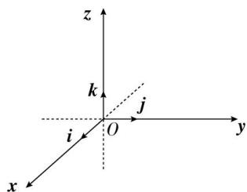

## （1）空间直角坐标系

在空间选定一点 O 和一个单位正交基底 $\left\{\vec{i},\vec{j},\vec{k}\right\}$ （如图），以点 O 为原点，分别以 $\vec{i},\vec{j},\vec{k}$ 的方向为正方向、以它们的长为单位长度建立三条数轴：x 轴、y 轴、z 轴，它们都叫做坐标轴。这时我们就建立了一个空间直角坐标系 Oxyz，O 叫做原点， $\vec{i},\vec{j},\vec{k}$ 都叫做坐标向量，通过每两条坐标轴的平面叫做坐标平面，分别称为 xOy 平面，yOz 平面，xOz 平面，它们把空间分成八个部分。

