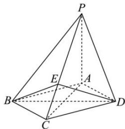

<!-- question-source:start -->
【36】（2023·全国高三专题练习）如图，在四棱锥 $P - ABCD$ ，底面ABCD为菱形， $PA\bot$ 底面ABCD， $AC = 2\sqrt{2}$ ， $PA = 2$ ， $E$ 是 $PC$ 上的一点， $PE = 2EC$ 。证明 $PC\bot$ 平面BED.

<!-- question-source:end -->

![[Q00005433A1]]
