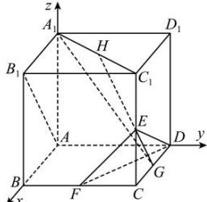

<!-- question-source:start -->
【35】（2023·黑龙江齐齐哈尔高二阶段练习）在正方体 $ABCD-A_{1}B_{1}C_{1}D_{1}$ 中，已知 E、F、G、H 分别是 $CC_{1}$ 、BC、CD 和 $A_{1}C_{1}$ 的中点.

（1）证明： $AB_{1} // GE$ ， $AB_{1} \perp EH$ ；

(2) 证明: $A_{1}G \perp$ 平面 $EFD$ .
<!-- question-source:end -->

![[Q00005631A1]]
