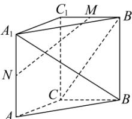

<!-- question-source:start -->
【55】如图, 直三棱柱 $ABC - A_{1}B_{1}C_{1}$ 中, CA = CB = 1, $\angle BCA = 90^{\circ}$ , $AA_{1} = 2$ , M, N 是 $B_{1}C_{1}$ , $A_{1}A$ 的中点.

(1) 求 M, N 的距离;

(2) 求 $\cos\left\langle\overrightarrow{BA_{1}},\overrightarrow{CB_{1}}\right\rangle$ 的值.
<!-- question-source:end -->

![[Q00005632A1]]
