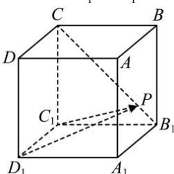

<!-- question-source:start -->
【57】（2023·北京）如图, 长方体 $ABCD - A_{1}B_{1}C_{1}D_{1}$ 中, $CC_{1} = C_{1}D_{1} = \sqrt{3}$ , $C_{1}B_{1} = 1$ , 点 P 为线段 $B_{1}C$ 上一点, 则 $\overrightarrow{C_{1}P} \cdot \overrightarrow{D_{1}P}$ 的最小值为 \_\_\_\_.

<!-- question-source:end -->

![[Q00005454A1]]
