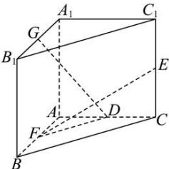

<!-- question-source:start -->
【58】（24-25 高二·四川攀枝花）如图，在直三棱柱 $ABC-A_{1}B_{1}C_{1}$ 中， $\angle BAC=\frac{\pi}{2}$ ， $AB=AC=AA_{1}=1$ ，已知 G 与 E 分别为 $A_{1}B_{1}$ 和 $CC_{1}$ 的中点，D 与 F 分别为线段 AC 和 AB 上的动点（不包括端点），若 $GD\perp EF$ ，则线段 DF 的长度的取值范围为（）

A. $\left[\sqrt{2},\sqrt{3}\right]$ B. $\left[\frac{\sqrt{2}}{4},\frac{\sqrt{5}}{2}\right]$ C. $\left[\frac{\sqrt{5}}{5},1\right)$ D. $\left[\frac{\sqrt{5}}{5},\sqrt{2}\right)$
<!-- question-source:end -->

![[Q00005455A1]]
