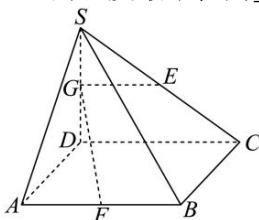

<!-- question-source:start -->
【61】(23-24 高二·河北衡水·阶段练习) 如图, 在四棱锥 S-ABCD 中, 底面 ABCD 为正方形, AB=2, SD⊥底面 ABCD, 点 E、F 分别为 SC、AB 的中点, 若线段 SD 上存在点 G, 使得 GE⊥GF, 则线段 SD 的长度最小值为 \_\_\_\_.

第三节 空间向量及其运算的坐标表示
<!-- question-source:end -->

![[Q00005458A1]]
