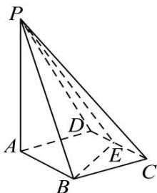

<!-- question-source:start -->
【19】如图所示, 四棱锥 P-ABCD 的底面 ABCD 是边长为 1 的菱形, $\angle BCD=60^{\circ}$ , E 是 CD 的中点, PA⊥底面 ABCD, PA=2. 试建立适当的空间直角坐标系, 求出 A, B, C, D, P, E 的坐标.

<!-- question-source:end -->

![[Q00005416A1]]
