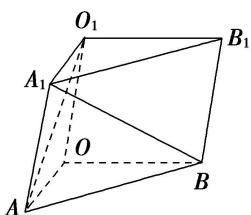

<!-- question-source:start -->
【20】如图所示, 在三棱柱 $OAB-O_{1}A_{1}B_{1}$ 中, 平面 $OBB_{1}O_{1}\perp$ 平面 OAB, $\angle O_{1}OB=60^{\circ}$ , $\angle AOB=90^{\circ}$ 且 $OB=OO_{1}=2$ , $OA=\sqrt{3}$ , 请建立适当空间直角坐标系, 并求各个点的坐标.

第三节 空间向量及其运算的坐标表示
<!-- question-source:end -->

![[Q00005417A1]]
