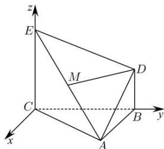

> [!faq]- 全练一本通解析
> **【答案】** 答案见解析
>
> **【解析】**
> $\triangle ABC$ 是一个正三角形， $EC \perp$ 平面 ABC，以 C 为原点，平面 ABC 内过 C 点垂直于 BC 的直线为 x 轴，CB 为 y 轴，CE 为 z 轴，建立如图所示的空间直角坐标系 Cxyz.
> 
> 则有 $C(0,0,0), A(\sqrt{3},1,0), B(0,2,0), E(0,0,2), D(0,2,1), M\left(\frac{\sqrt{3}}{2}, \frac{1}{2}, 1\right)$ 。
