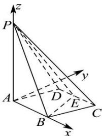

> [!faq]- 全练一本通解析
> **【答案】** 详见解析
>
> **【解析】**
> 如图所示, 以 A 为原点, 以 AB 所在直线为 x 轴, AP 所在直线为 z 轴, 过点 A 与 xAz 平面垂直的直线为 y 轴, 建立空间直角坐标系.
> 则相关各点的坐标分别是: $A(0,0,0)$ , $B(1,0,0)$ , $C(\frac{3}{2},\frac{\sqrt{3}}{2},0)$ , $D(\frac{1}{2},\frac{\sqrt{3}}{2},0)$ , $P(0,0,2)$ , $E(1,\frac{\sqrt{3}}{2},0)$ .
> 
