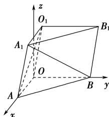

> [!faq]- 全练一本通解析
> **【答案】** 答案见解析
>
> **【解析】**
> 已知平面 $OBB_{1}O_{1} \perp$ 平面 OAB， $\angle O_{1}OB = 60^{\circ}$ ，
> 在平面 $OBB_{1}O_{1}$ 取一向量 $\vec{z} \perp OB$ ，由于平面 $OBB_{1}O_{1} \cap$ 平面 OAB = OB，
> 所以 $\vec{z} \perp$ 平面 OAB，又 $\angle AOB = 90^{\circ}$ ，所以 $\vec{z}, OA, OB$ 两两垂直，
> 以 O 为原点， $\overrightarrow{OA}, \overrightarrow{OB}, \vec{z}$ 的方向为 x, y, z 轴的正方向建立空间直角坐标系 Oxyz,
> 如图所示
> 
> 因为 $OO_{1}=2,\angle O_{1}OB=60^{\circ}$ ，所以 $O_{1}$ 到 z 轴的距离为 $\left|OO_{1}\right|\cos60^{\circ}=2\times\frac{1}{2}=1$ 三棱柱 $OAB-O_{1}A_{1}B_{1}$ 的高为 $\left|OO_{1}\right|\sin60^{\circ}=2\times\frac{\sqrt{3}}{2}=\sqrt{3}$ 则 $O(0,0,0)$ , $O_{1}(0,1,\sqrt{3})$ , $A(\sqrt{3},0,0)$ , $A_{1}(\sqrt{3},1,\sqrt{3})$ , $B(0,2,0)$ , $B_{1}(0,3,\sqrt{3})$ .
