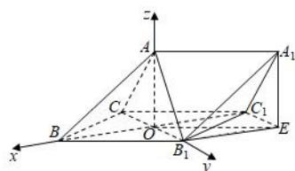
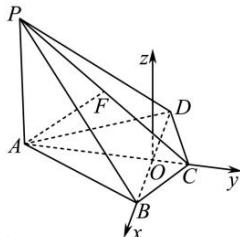

> [!faq]- 全练一本通解析
> **【答案】** $(- \sqrt{3},1,1)$
>
> **【解析】**
> 由侧面 $BB_{1}C_{1}C$ 是边长为 2 的菱形， $\angle CBB_{1}=60^{\circ}$ ，可得 $OB_{1}=1,OC_{1}=\sqrt{3}$ ，
> 又由 AO ⊥ 侧面 $BB_{1}C_{1}C$ ，且 $\triangle AB_{1}C$ 为等腰直角三角形，可得 OA=1，
> 如图所示，过点 $A_{1}$ 作 $A_{1}E \perp$ 平面 $BCC_{1}B_{1}$ ，垂足为 E，连接 $B_{1}E,C_{1}E$ ，
> 则 $B_{1}E//OC_{1},C_{1}E//OB_{1},A_{1}E//AO$ ，
> 所以 $A_{1}$ 的坐标为 $(- \sqrt{3},1,1)$ 。
> 
> 【23】答案见解析
> 【25】答案见解析
> 解析:如图,连接 BD 交 AC 于 O,
> ∵ BC = CD , ∴△BCD 为等腰三角形, 又 AC 平分 ∠BCD , ∴ AC ⊥ BD ;
> 以 O 为坐标原点, $\overrightarrow{OB}, \overrightarrow{OC}$ 正方向为 x, y 轴, 作 z 轴 //PA , 可建立如图所示空间直角坐标系,
> 
> $\because OC = CD\cos \frac{\pi}{3} = 1, AC = 4, \therefore AO = AC - OC = 3,$ 又 $OB = OD = CD\sin \frac{\pi}{3} = \sqrt{3}$ 则 $A(0, - 3,0),B(\sqrt{3},0,0),C(0,1,0),D(-\sqrt{3},0,0),P(0, - 3,2),O(0,0,0),$ $F(0, - 1,1).$
> 【24】（1） $(2,3,1);(-2,3,-1);(2,-3,-1)$ （2） $(2, - 3,1);(-2,3,1),(-2,-3,-1)$ （3） $(-2,-3,1)$
> 解析：（1）设点 P 关于 xOy 坐标平面的对称点为 $P'$ ，
> 则点 $P'$ 在 x 轴上的坐标及在 y 轴上的坐标与点 P 的坐标相同, 而点 $P'$ 在 z 轴上的坐标与点 P 在 z 轴上的坐标互为相反数.
> 所以, 点 P 关于 xOy 坐标平面的对称点 $P'$ 的坐标为 $(2,3,1)$ .
> 同理, 点 P 关于 yOz, zOx 坐标平面的对称点的坐标分别为 $(-2,3,-1)$ , $(2,-3,-1)$ .
> （2）设点 P 关于 x 轴的对称点为 Q，
> 则点 Q 在 x 轴上的坐标与点 P 的坐标相同, 而点 Q 在 y 轴上的坐标及在 z 轴上的坐标与点 P 在 y 轴上的坐标及在 z 轴上的坐标互为相反数. 所以, 点 P 关于 x 轴的对称点 Q 的坐标为 $(2,-3,1)$ .
> 同理, 点 P 关于 y 轴、z 轴的对称点的坐标分别为 $(-2,3,1)$ , $(-2,-3,-1)$ .
> （3）点 $P(2,3,-1)$ 关于坐标原点的对称点的坐标为 $(-2,-3,1)$ .
> ## 重点题型专练
