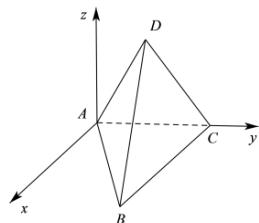
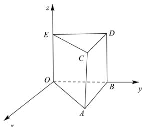

> [!faq]- 全练一本通解析
> **【答案】** 答案见解析
>
> **【解析】**
> （1）如图建立空间直角坐标系，
> 
> 则由棱长为1的正四面体知， $A(0,0,0),B(\frac{\sqrt{3}}{2},\frac{1}{2},0),C(0,1,0),D(\frac{\sqrt{3}}{6},\frac{1}{2},\frac{\sqrt{6}}{3}).$ （2）如图建立空间直角坐标系，
> 
> 则由底面边长为1, 高为2的正三棱柱可得 $O(0,0,0), B(0,1,0), A(\frac{\sqrt{3}}{2}, \frac{1}{2}, 0)$ , $E(0,0,2), D(0,1,2), C(\frac{\sqrt{3}}{2}, \frac{1}{2}, 2)$ .
