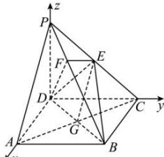

> [!faq]- 全练一本通解析
> **【答案】** （1）证明见解析；（2）证明见解析
>
> **【解析】**
> （1）证明:如图所示 D 为坐标原点，DA 为 x 轴，DC 为 y 轴，DP 为 z 轴，建立空间直角坐标系，
> 
> 设 DC=a .
> 连接 AC, AC 交 BD 于 G, 连接 EG.
> 依题意得. $A(a,0,0)$ ， $P(0,0,a)$ ， $E(0,\frac{a}{2},\frac{a}{2})$
> 因为底面 ABCD 是正方形, 所以 G 是此正方形的中心,
> 故点 $G$ 的坐标为 $(\frac{a}{2}, \frac{a}{2}, 0)$ 且. $\overrightarrow{PA} = (a, 0, -a)$ , $\overrightarrow{EG} = (\frac{a}{2}, 0, -\frac{a}{2})$ ,
> 所以 $\overrightarrow{PA}=2\overrightarrow{EG}$ ，这表明 $PA//EG$ 。
> $$
> E G \subset
> $$
> （2）证明：依题意得 $B(a,a,0)$ ， $\overrightarrow{PB}=(a,a,-a)$ ，
> 又 $\overrightarrow{DE} = (0, \frac{a}{2}, \frac{a}{2})$ ，故 $\overrightarrow{PB} \cdot \overrightarrow{DE} = 0 + \frac{a^2}{2} - \frac{a^2}{2} = 0$ ，
> 所以 $PB \perp DE$ ，
> 由已知 $EF \perp PB$ ，且 $EF \cap DE = E$ ， $EF, DE \subset$ 面 $EFD$ ，所以 $PB \perp$ 平面 $EFD$ 。
