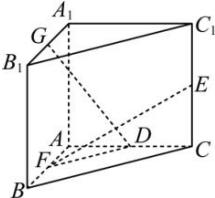

<!-- question-source:start -->
【49】如图, 直三棱柱 $ABC - A_{1}B_{1}C_{1}$ 中, $\angle BAC = 90^{\circ}AB = AC = AA_{1} = 4$ , 点 G, E, F 分别是 $A_{1}B_{1}$ 、 $CC_{1}$ 、AB 的中点, 点 D 是 AC 上的动点. 若 $GD \perp EF$ , 则线段 DF 长度为 \_\_\_\_.

<!-- question-source:end -->

![[Q00005446A1]]
