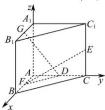

> [!faq]- 全练一本通解析
> **【答案】** $\sqrt{5}$
>
> **【解析】**
> 如图, 以点 A 为原点, 以 $\overrightarrow{AB},\overrightarrow{AC},\overrightarrow{AA_{1}}$ 为 x,y,z 轴建立空间直角坐标系, $E(0,4,2)$ , $F(2,0,0)$ , $G(2,0,4)$ , $D(0,y,0)$ , $\overrightarrow{GD}=(-2,y,-4),\overrightarrow{EF}=(2,-4,-2)$ 因为 $GD \perp EF$ ，所以 $\overrightarrow{GD} \cdot \overrightarrow{EF} = -2 \times 2 - 4y + (-4) \times (-2) = 0$ ，得 y = 1，
> 即 $D(0,1,0)$ ，所以 $|FD|=\sqrt{(2-0)^{2}+(0-1)^{2}}=\sqrt{5}$
> 
