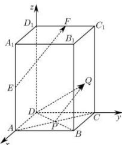

> [!faq]- 全练一本通解析
> **【答案】** $\frac{3\sqrt{5}}{4}$
>
> **【解析】**
> 建立如图所示空间直角坐标系， $E\left(2,0,\frac{3}{2}\right),F(0,1,3),\overrightarrow{EF}=\left(-2,1,\frac{3}{2}\right),P(1,1,0)$ $Q \in$ 平面 $CDD_{1}C_{1}$ ，故可设 $Q(0,a,b)$ ，则 $\overrightarrow{PQ}=(-1,a-1,b)$ ，
> 由于 $\overrightarrow{EF} \parallel \overrightarrow{PQ}$ ，所以 $\overrightarrow{EF}=2\overrightarrow{PQ}$ ，
> 所以 $\left\{\begin{aligned}&1=2(a-1)\\&\frac{3}{2}=2b\end{aligned}\right.$ ，解得 $a=\frac{3}{2},b=\frac{3}{4}$ ，
> 所以 $Q\left(0,\frac{3}{2},\frac{3}{4}\right),\left|\overrightarrow{DQ}\right|=\sqrt{\frac{9}{4}+\frac{9}{16}}=\frac{3\sqrt{5}}{4}$ . 故答案为： $\frac{3\sqrt{5}}{4}$
> 
