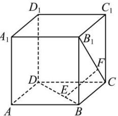

<!-- question-source:start -->
【62】如图, 棱长为 1 的正方体 $ABCD - A_{1}B_{1}C_{1}D_{1}$ 中, 点 E 在 BD 上, 点 F 在 $CB_{1}$ 上, 则 EF 的最小值为（）

A. 1 B. $\frac{\sqrt{2}}{2}$ C. $\frac{\sqrt{3}}{3}$ D. $\frac{1}{2}$
<!-- question-source:end -->

![[Q00005459A1]]
