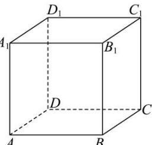

<!-- question-source:start -->
【63】(24-25 高二上·上海·课堂例题) 如图, 正方体 $ABCD - A_{1}B_{1}C_{1}D_{1}$ 的棱长为 1, 动点 M 在线段 $CC_{1}$ 上, 动点 P 在平面 $A_{1}B_{1}C_{1}D_{1}$ 上, 且 $AP \perp$ 平面 $MBD_{1}$ .

（1）当点 M 与点 C 重合时, 求线段 AP 的长度;
(2) 求线段 AP 长度的最小值.
<!-- question-source:end -->

![[Q00005634A1]]
