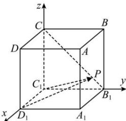

> [!faq]- 全练一本通解析
> **【答案】** $\frac{3}{4}$
>
> **【解析】**
> 以 $C_{1}$ 为坐标原点，分别以 $C_{1}D_{1},C_{1}B_{1},C_{1}C$ 为 x,y,z 轴，建立空间直角坐标系，
> 则 $C_{1}(0,0,0), D_{1}(\sqrt{3},0,0), P(0,m,\sqrt{3}-\sqrt{3}m), 0\leq m\leq1$
> 
> 则 $\overrightarrow{C_{1}P}\cdot\overrightarrow{D_{1}P}=\left(0,m,\sqrt{3}-\sqrt{3}m\right)\cdot\left(-\sqrt{3},m,\sqrt{3}-\sqrt{3}m\right)=m^{2}+\left(\sqrt{3}-\sqrt{3}m\right)^{2}$ $=4m^{2}-6m+3=4\left(m-\frac{3}{4}\right)^{2}+\frac{3}{4}$ 当 $m=\frac{3}{4}$ 时， $\overline{C_{1}P}\cdot\overline{D_{1}P}$ 的最小值为 $\frac{3}{4}$ . 故答案为: $\frac{3}{4}$
