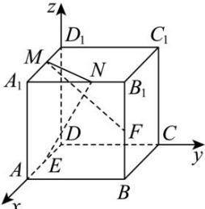

> [!faq]- 全练一本通解析
> **【答案】** $\frac{4\sqrt{5}}{5}$
>
> **【解析】**
> 以 D 为坐标原点, DA, DC, $DD_{1}$ 所在的直线分别为 x 轴、y 轴、z 轴, 建立空间直角坐标系, 如图所示.
> 
> 因为点 E, F 分别为棱 DA, $BB_{1}$ 的中点, 所以 $E(2,0,0)$ , $F(4,4,2)$ ,
> 设 $M(x,0,4)$ , $N(4,y,4)$ ，其中 0 < x < 4, 0 < y < 4，
> 则 $\overline{EN}=(2,y,4)$ , $\overline{FM}=(x-4,-4,2)$ .
> 因为 $\overline{EN} \perp \overline{FM}$ ，则 $\overline{EN} \cdot \overline{FM} = (2, y, 4) \cdot (x - 4, -4, 2) = 2x - 4y = 0$ ，解得 x = 2y，
> 又因为 0 < x < 4, 0 < y < 4，则 0 < y < 2，
> 可得 $MN=\sqrt{(x-4)^{2}+y^{2}+(4-4)^{2}}=\sqrt{(2y-4)^{2}+y^{2}}=\sqrt{5\left(y-\frac{8}{5}\right)^{2}+\frac{16}{5}}$ 所以 $MN_{\min}=\frac{4\sqrt{5}}{5}$ ，此时 $y=\frac{8}{5}$ ，即线段 MN 的长度的最小值为 $\frac{4\sqrt{5}}{5}$ .
> 故答案为： $\frac{4\sqrt{5}}{5}$ .
