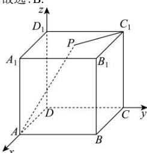
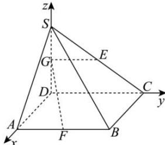

> [!faq]- 全练一本通解析
> **【答案】** B
>
> **【解析】**
> 解析:如图,以点 D 为坐标原点, DA, DC, $DD_{1}$ 所在直线分别为 x, y, z 轴, 建立空间直角坐标系,
> 则 $A(1,0,0)$ , $C_{1}(0,1)$ ，设 $P(x,y,z)$ ， $0\leq x\leq1$ ， $0\leq y\leq1$ ，z=1， $\therefore\overrightarrow{PA}=(1-x,-y,-1),\overrightarrow{PC_{1}}=(-x,1-y,0)$ $\therefore\overrightarrow{PA}\cdot\overrightarrow{PC_{1}}=-x(1-x)-y(1-y)=x^{2}-x+y^{2}-y=\left(x-\frac{1}{2}\right)^{2}+\left(y-\frac{1}{2}\right)^{2}-\frac{1}{2}$ 当 $x=y=\frac{1}{2}$ 时， $\overrightarrow{PA}\cdot\overrightarrow{PC_{1}}$ 取得最小值 $-\frac{1}{2}$ 当 x=0 或 1, y=0 或 1 时， $\overrightarrow{PA}\cdot\overrightarrow{PC_{1}}$ 取得最大值 0，
> 所以 $\overrightarrow{PA}\cdot\overrightarrow{PC_{1}}$ 的取值范围是 $\left[-\frac{1}{2},0\right]$ .
> 故选:B.
> 
> 解析: 以 D 为原点, 以 DA, DC, DS 所在的直线分别为 x, y, z 轴, 建立空间直角坐标系,
> 如图所示, 设 SD = a, a > 0, DG = λ, 0 < λ < a,
> 则 $S(0,0,a), G(0,0,\lambda), E\left(0,1,\frac{a}{2}\right), F(2,1,0)$ ,
> 则 $\overrightarrow{GE}=\left(0,1,\frac{a}{2}-\lambda\right),\overrightarrow{GF}=\left(2,1,-\lambda\right)$ ,
> 因为 $GE \perp GF$ ，所以 $\overrightarrow{GE} \cdot \overrightarrow{GF} = 1 - \lambda \left( \frac{a}{2} - \lambda \right) = 0$ ，
> 则 $a = 2\left(\lambda + \frac{1}{\lambda}\right) \geq 2 \times 2\sqrt{\lambda \cdot \frac{1}{\lambda}} = 4$ ，当且仅当 $\lambda = \frac{1}{\lambda}$ 时，即 $\lambda = 1$ 时，等号成立，所以 $a \geq 4$ ，即 $SD \geq 4$ ，所以 $SD$ 长度的最小值为 4。故答案为：4。
> 
