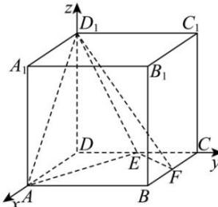

> [!faq]- 全练一本通解析
> **【答案】** (1) $\sqrt{2}$ (2) $\frac{\sqrt{6}}{2}$
>
> **【解析】**
> （1）如图，以 D 为坐标原点，DA、DC、 $DD_{1}$ 所在直线分别为 x、y、z 轴，建立空间直角坐标
> 系, 则 $A(1,0,0)$ ， $B(1,1,0)$ ， $D_{1}(0,0,1)$ .
> 
> 设 $M(0,1,m)$ ， $P(x,y,1)$ ，则 $\overrightarrow{AP}=(x-1,y,1)$ ， $\overrightarrow{BD_{1}}=(-1,-1,1)$ ， $\overrightarrow{BM}=(-1,0,m)$ 。因为 $AP \perp$ 平面 $MBD_{1}$ ，
> 所以 $\left\{\begin{aligned}\overrightarrow{AP}\cdot\overrightarrow{BM}&=0,\\ \overrightarrow{AP}\cdot\overrightarrow{BD_{1}}&=0,\end{aligned}\right.$ 得 $\left\{\begin{aligned}1-x+m&=0,\\ 2-x-y&=0.\end{aligned}\right.$ 当点 M 与点 C 重合时，m=0，x=y=1，此时 $\overrightarrow{AP}=(0,1,1)$ ，
> 则 AP 的长度为 $\sqrt{1^{2}+1^{2}}=\sqrt{2}$ .
> （2） $\left|\overrightarrow{AP}\right|=\sqrt{(x-1)^{2}+y^{2}+1}=\sqrt{2y^{2}-2y+2}=\sqrt{2\left(y-\frac{1}{2}\right)^{2}+\frac{3}{2}}\geq\frac{\sqrt{6}}{2}$ 即线段 AP 长度的最小值为 $\frac{\sqrt{6}}{2}$ .
