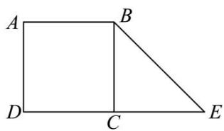
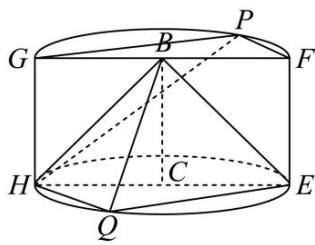

<!-- question-source:start -->
【9】(2024·山东青岛高一)如图1, 直角梯形ABED中， $AB = AD = 1$ ， $DE = 2$ ， $AD \perp DE$ ， $BC \perp DE$ ，以BC为轴将梯形ABED旋转 $180^{\circ}$ 后得到几何体W，如图2，其中GF，HE分别为上下底面直径，点P，Q分别在圆弧GF，HE上，直线PF//平面BHQ．（1）证明：平面 $BHQ \perp$ 平面PGH；（2）若直线GQ与平面PGH所成角的正切值等于 $\sqrt{2}$ ，求P到平面BHQ的距离；（3）若平面BHQ与平面BEQ夹角的余弦值 $\frac{1}{3}$ ，求HQ．

图1

图2
<!-- question-source:end -->

![[Q00005614A1]]
