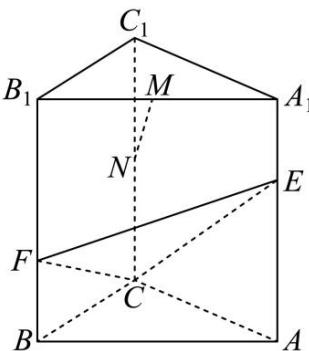

<!-- question-source:start -->
【3】（2024·河北）如图所示，三棱柱 $ABC-A_{1}B_{1}C_{1}$ 中，M,N 分别为棱 $A_{1}B_{1}, CC_{1}$ 的中点，E,F 分别是棱 $AA_{1}, BB_{1}$ 上的点， $A_{1}E = BF = \frac{1}{3}AA_{1}$ .
（1）求证：直线 MN // 平面 CEF；
（2）若三棱柱 $ABC-A_{1}B_{1}C_{1}$ 为正三棱柱，求平面 CEF 和平面 $ACC_{1}A_{1}$ 的夹角的大小.

第九节 专题:立体几何大题拔高专练
<!-- question-source:end -->

![[Q00005685A1]]
