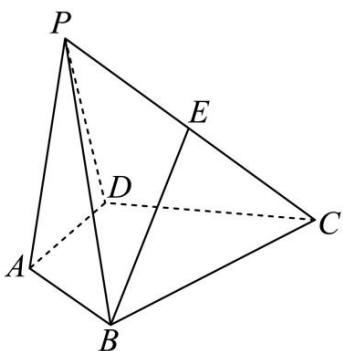

<!-- question-source:start -->
【6】（2024·河北石家庄高二练习）如图,在四棱锥
P-ABCD 中, $AB \perp AD$ , $AB = AD = \sqrt{2}$ , CD = BC, $PB = PD = \sqrt{5}$ , $\cos \angle BCD = \frac{4}{5}$ , E 为 PC 的中点.
（1）证明：BE // 平面 PAD；

（2）求平面 ABP 与平面 PBD 的夹角的余弦值的取值范围.

<!-- question-source:end -->

![[Q00005688A1]]
