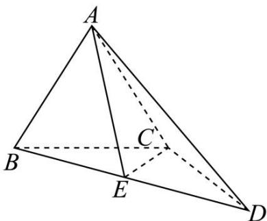

<!-- question-source:start -->
【8】（2024·贵州高三开学）在三棱锥 A-BCD 中， $AB = AC = BC = CD = 2, \angle BCD = 120^{\circ}, AB \perp AD, E$ 为线段 BD 的中点.

（1）证明： $AB \perp CE$ .

(2) 求平面 $ABC$ 与平面 $ACE$ 夹角的余弦值.

<!-- question-source:end -->

![[Q00005690A1]]
