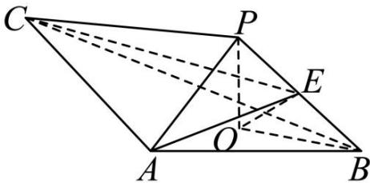
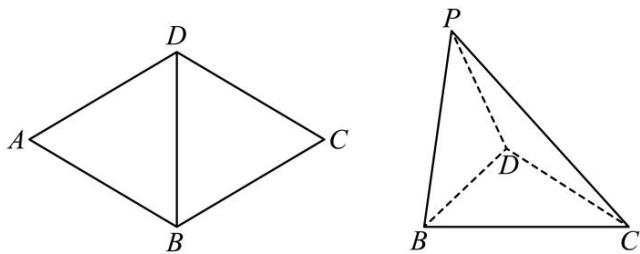

<!-- question-source:start -->
【2】（2024·全国高二单元测试）如图，PO 是三棱锥 P-ABC 的高， $PA = PB, AB \perp AC$ ，E 为 PB 的中点.
（1）证明：OE // 平面 PAC；
(2) 若 $\angle ABO = \angle CBO = 30^{\circ}, PO = 3, PA = 5$ ，求平面 ACE 与平面 ABE 所成角的正弦值.

<!-- question-source:end -->

![[Q00005684A1]]
