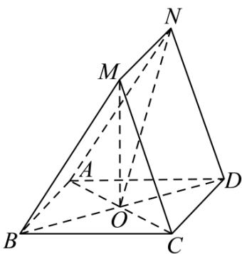

<!-- question-source:start -->
【5】（2023·全国模拟）如图, 已知四边形 ABCD 为正方形, O 为正方形对角线的交点, 平面 ABMN ∩ 平面 MNDC = MN, $MB = MC = \sqrt{5}$ , AB = MN = 2.

（1）求证: 平面 MNO ⊥ 平面 ABCD;

（2）求平面 AMC 和平面 AND 所成角的余弦值的最小值.

第九节 专题:立体几何大题拔高专练
<!-- question-source:end -->

![[Q00005687A1]]
