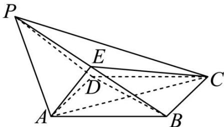

<!-- question-source:start -->
【10】（2024·浙江模拟）如图, 在四棱锥 P-ABCD 中, 底面 ABCD 为正方形, PA=PD=AB, E 为线段 PB 的中点, 平面 AEC⊥底面 ABCD.

（1）求证： $AE \perp$ 平面 PBD；

(2) 求直线 AB 与平面 PBC 所成角的正弦值.

<!-- question-source:end -->

![[Q00005691A1]]
