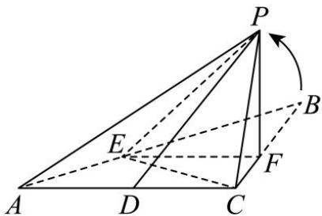

<!-- question-source:start -->
【13】（24-25 高二·黑龙江哈尔滨·开学考试）如下图, 在 $\triangle ABC$ 中, $AC \perp BC$ , AC = BC = 2, D 是 AC 中点, E、F 分别是 BA、BC 边上的动点, 且 $EF \parallel AC$ ; 将 $\triangle BEF$ 沿 EF 折起, 将点 B 折至点 P 的位置, 得到四棱锥;

(1) 求证: $EF \perp PC$

（2）若 $BE = 2AE$ ，二面角 $P - EF - C$ 是直二面角，求二面角 $P - CE - F$ 的正切值；

(3) 当 $PD \perp AE$ 时, 求直线 PE 与平面 ABC 所成角的正弦值的取值范围.
<!-- question-source:end -->

![[Q00005693A1]]
