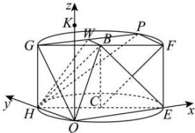

> [!faq]- 全练一本通解析
> **【答案】** （1）证明见解析（2） $\frac{\sqrt{3}}{3}$ （3）HQ= $\sqrt{2}$
>
> **【解析】**
> （1）设平面交上底面于 BW，W 在圆弧 GP 上，
> 因为上下底面平行，故 HQ // BW，
> 又因为 PF // 平面 BHQ，PF ⊂ 平面 PGF，平面 BHQ ∩ 平面
> PGF = BW，
> 所以 PF // BW，所以 HQ // PF，
> 由题意可知 PF ⊥ PG, PF ⊥ GH，又 GH ∩ PG = G，GH、PG ⊂ 平面
> PGH，
> 所以 PF ⊥ 平面 PGH，所以 HQ ⊥ 平面 PGH，
> 又 HQ ⊂ 平面 BHQ，平面 BHQ ⊥ 平面 PGH。
> （2）由（1）知 HQ ⊥ 平面 PGH，连接 GQ，所以 $\angle HGQ$ 是直线 GQ 与平面 PGH 所成角，
> 所以由题意 $\tan\angle HGQ=\frac{HQ}{HG}=\sqrt{2}\Rightarrow HQ=\sqrt{2}HG=\sqrt{2}$ 又由题意 $HQ \perp QE$ ，HE = 2，
> 所以 $QE = \sqrt{HE^{2} - HQ^{2}} = \sqrt{2^{2} - \sqrt{2^{2}}} = \sqrt{2}$ ，所以 $CQ \perp HE$ ，即 Q 在圆弧 HE 的中点上，
> 所以由 HQ // PF 知点 P 在圆弧 GF 中点上，故 $PG = PF = \sqrt{2}$ 所以 $WH = \sqrt{HG^{2} + GW^{2}} = \sqrt{1^{2} + \left(\frac{\sqrt{2}}{2}\right)^{2}} = \frac{\sqrt{6}}{2}$ 因为 PF // 平面 BHQ，所以点 P 到平面 BHQ 的距离即为 F 到平面 BHQ 的距离，
> 又圆柱结构性质可知 FC // BH，FC ≠ 平面 BHQ，BH ⊂ 平面 BHQ，
> 所以 FC // 平面 BHQ，所以 F 到平面 BHQ 的距离即为 C 到平面 BHQ 的距离，设该距离为 d，
> 因为 $V_{C-BHQ} = \frac{1}{3} S_{\triangle BHQ} d = \frac{1}{3} \times \frac{1}{2} WH \times HQ \times d = \frac{1}{6} \times \frac{\sqrt{6}}{2} \times \sqrt{2} \times d = \frac{\sqrt{3}}{6} d$ $V_{B-HCQ}=\frac{1}{3}S_{\triangle HCQ}\times CB=\frac{1}{3}\times\frac{1}{2}\times HC\times CQ\times CB=\frac{1}{3}\times\frac{1}{2}\times1\times1\times1=\frac{1}{6}$ 又 $V_{C-BHQ}=V_{B-HCQ}$ ，所以 $\frac{\sqrt{3}}{6}d=\frac{1}{6}\Rightarrow d=\frac{\sqrt{3}}{3}$ ，即点 P 到平面 BHQ 的距离为 $\frac{\sqrt{3}}{3}$ .
> （3）过 $Q$ 作 $QK$ 垂直于底面, 则由上知 $HQ \perp QE$ , 所以可建立如图所示的分别以 $QE$ 、 $QH$ 、 $QK$ 为 $x$ 、 $y$ 、 $z$ 轴的空间直角坐标系 $Q - xyz$ , 则 $Q(0,0,0)$ , 设 $H(0,b,0), E(a,0,0), B\left(\frac{a}{2}, \frac{b}{2}, 1\right)$ , 且 $0 < a$ 、 $b < 4$ , 所以 $\overrightarrow{QH} = (0,b,0), \overrightarrow{QE} = (a,0,0), \overrightarrow{QB} = \left(\frac{a}{2}, \frac{b}{2}, 1\right)$ , 设平面 $BHQ$ 的法向量为 $\vec{m} = (x_1, y_1, z_1)$ , 则 $\begin{cases} \vec{m} \perp \overrightarrow{QH} \\ \vec{m} \perp \overrightarrow{QB} \end{cases}$ ,
> 所以 $\left\{\begin{aligned}\vec{m}\cdot\overrightarrow{QH}&=0\\\vec{m}\cdot\overrightarrow{QB}&=0\end{aligned}\right.$ 即 $\left\{\begin{aligned}by_{1}&=0\\\frac{a}{2}x_{1}&+\frac{b}{2}y_{1}+z_{1}=0\end{aligned}\right.$ ，取 $x_{1}=2$ 可求得 $\vec{m}=(2,0,-a)$ ，
> 
> 设平面 BEQ 的法向量为 $\vec{n} = (x_{2}, y_{2}, z_{2})$ ，则 $\left\{\begin{aligned}\vec{n} \perp \overrightarrow{QE} \\ \vec{n} \perp \overrightarrow{QB}\end{aligned}\right.$ 所以 $\left\{\begin{aligned}\vec{n}\cdot\overrightarrow{QE}=0\\ \vec{n}\cdot\overrightarrow{QB}=0\end{aligned}\right.$ 即 $\left\{\begin{aligned}ax_{2}=0\\ \frac{a}{2}x_{2}+\frac{b}{2}y_{2}+z_{2}=0\end{aligned}\right.$ ，取 $y_{2}=2$ 可求得 $\vec{n}=(0,2,-b)$ ，
> 设平面 BHQ 与平面 BEQ 的夹角为 $\theta$ ，则 $\cos\theta=\left|\frac{\vec{m}\cdot\vec{n}}{\left|\vec{m}\right|\left|\vec{n}\right|}\right|=\left|\frac{\vec{m}\cdot\vec{n}}{\left|\vec{m}\right|\left|\vec{n}\right|}\right|=\frac{\left|ab\right|}{\sqrt{4+a^{2}}\sqrt{4+b^{2}}}=\frac{1}{3}$ ，且 $a^{2}+b^{2}=4$ ，
> 整理得 $9a^{2}b^{2}=(4+a^{2})(4+b^{2})=16+4(a^{2}+b^{2})+a^{2}b^{2}=32+a^{2}b^{2}\Rightarrow a^{2}b^{2}=4$ 所以 $a^{2}b^{2}=a^{2}(4-a^{2})=4a^{2}-a^{4}=4$ 即 $a^{4}-4a^{2}+4=(a^{2}-2)^{2}=0$ $\Rightarrow a^{2}=2$ 即 $a=\sqrt{2}$ ，所以 $2b^{2}=4\Rightarrow b=\sqrt{2}$ 所以 $H(0,\sqrt{2},0)$ ，所以 $HQ=\sqrt{2}$ .
