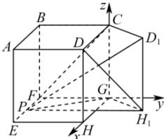

> [!faq]- 全练一本通解析
> **【答案】** （1） $\frac{32\sqrt{5}}{3}$ （2） $\frac{1 + \sqrt{5}}{4}$
>
> **【解析】**
> （1）由题意 $D_{1}H_{1}\perp$ 平面 $EFGH,PH_1\subset$ 平面 $EFGH$ ，所以 $D_{1}H_{1}\perp PH_{1}$ ，又因为 $\tan \angle D_1PH_1 = \frac{2}{3}$ 得 $\frac{D_1H_1}{PH_1} = \frac{2}{3}$ ，所以 $PH_{1} = 6$ 因为 $PG = 2\sqrt{5},GH_{1} = 4,PH_{1} = 6$
> 所以 $PG^{2} + GH_{1}^{2} = PH_{1}^{2}$ 故 $PG\perp GH_{1}$ ，又 $D_{1}H_{1}\perp PG,GH_{1}\cap D_{1}H_{1} = H_{1}$ 故 $PG\perp$ 平面 $CD_1H_1G$ 所以 $V_{\text{四棱锥}P - CD_1H_1G} = \frac{1}{3}\times 4\times 4\cdot PG = \frac{32\sqrt{5}}{3}$
> （2）如图, 易知 GH, FG, GC 两两垂直, 以 G 为原点, $\overrightarrow{GH}, \overrightarrow{FG}, \overrightarrow{GC}$ 为 x, y, z 轴建立空间直角坐标系,
> 
> 由题知 $\angle HGH_{1} = \theta$ ，则 $G(0,0,0),C(0,0,4),H_{1}(4\cos \theta ,4\sin \theta ,0),D(4,0,4)$ 故 $\overline{GC} = (0,0,4),\overline{GH_1} = (4\cos \theta ,4\sin \theta ,0)$ 设平面 $CD_{1}H_{1}G$ 的一个法向量为 $\vec{m} = (x,y,z)$ 由 $\left\{ \begin{array}{l}\vec{m}\cdot \overrightarrow{GC} = 0,\\ \vec{m}\cdot \overrightarrow{GH_1} = 0, \end{array} \right.$ 得 $\left\{ \begin{array}{l}4z = 0,\\ 4x\cos \theta +4y\sin \theta = 0, \end{array} \right.$ 取 $y = 1$ ，得 $x = -\tan \theta$ ，故 $\vec{m} = (-\tan \theta ,1,0)$ 又 $\overline{DH_1} = (4\cos \theta -4,4\sin \theta , - 4)$ $\sin \frac{\pi}{6} = |\cos \overline{DH_1},\vec{m}| = \frac{| - 4\sin\theta + 4\tan\theta + 4\sin\theta|}{\sqrt{1 + \tan^2\theta}\cdot\sqrt{16(\cos\theta - 1)^2 + 16\sin^2\theta + 16}}$ 即 $\frac{\tan\theta}{\sqrt{1 + \tan^2\theta}\cdot\sqrt{(\cos\theta - 1)^2 + \sin^2\theta + 1}} = \frac{1}{2},$ 化简可得 $4\cos^2\theta -2\cos \theta -1 = 0$ 解得 $\cos \theta = \frac{1 + \sqrt{5}}{4}$ 或 $\cos \theta = \frac{1 - \sqrt{5}}{4}$ （舍去）.
