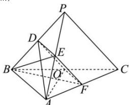
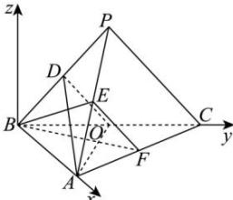

> [!faq]- 全练一本通解析
> **【答案】** （1）证明见解析（2）证明见解析（3） $-\frac{\sqrt{2}}{2}$
>
> **【解析】**
> （1）连接 DE,OF，设 AF=tAC，
> 则 $\overrightarrow{BF}=\overrightarrow{BA}+\overrightarrow{AF}=\overrightarrow{BA}+t(\overrightarrow{AB}+\overrightarrow{BC})=(1-t)\overrightarrow{BA}+t\overrightarrow{BC}$ ， $\overrightarrow{AO}=-\overrightarrow{BA}+\frac{1}{2}\overrightarrow{BC}$ ，因为 $BF\perp AO$ ， $AB\perp BC$ ，
> 则 $\overrightarrow{BF}\cdot\overrightarrow{AO}=[(1-t)\overrightarrow{BA}+t\overrightarrow{BC}]\cdot(-\overrightarrow{BA}+\frac{1}{2}\overrightarrow{BC})=(t-1)\overrightarrow{BA}^{2}+\frac{1}{2}t\overrightarrow{BC}^{2}=4(t-1)+4t=0$ 解得 $t=\frac{1}{2}$ ，则 F 为 AC 的中点，由 D,E,O,F 分别为 PB,PA,BC,AC 的中点，
> 
> 于是 $DE / / AB, DE = \frac{1}{2} AB, OF / / AB, OF = \frac{1}{2} AB$ ，即 $DE / / OF, DE = OF$ ，则四边形 $ODEF$ 为平行四边形，所以 $EF / / DO$ ，又 $EF \not\subset$ 平面 $ADO, DO \subset$ 平面 $ADO$ ，所以 $EF / /$ 平面 $ADO$ ；（2）因为 $D, O$ 分别为 $BP, BC$ 中点，所以 $DO / / PC, DO = \frac{1}{2} PC$ ，因为 $PC = \sqrt{6}$ ，所以 $DO = \frac{\sqrt{6}}{2}$ ，因为 $BO = \frac{1}{2} BC = \sqrt{2}$ ， $AB = 2$ ， $AB \perp BO$ ，所以 $AO = \sqrt{6}$ ，因为 $AD = \frac{\sqrt{30}}{2}$ ，所以 $AO^2 + OD^2 = AD^2$ ，即 $AO \perp OD$ ，因为 $DO / / EF$ ，所以 $AO \perp EF$ ，又因为 $AO \perp BF, EF \cap BF = F, EF, BF \subset$ 平面 $BEF$ ，所以 $AO \perp$ 平面 $BEF$ ；（3）因为 $AB \perp BC$ ，过点 $B$ 作 $z$ 轴 $\perp$ 平面 $BAC$ ，建立如图所示的空间直角坐标系，
> 
> $$
> A (2, 0, 0,), B (0, 0, 0), C (0, 2 \sqrt {2}, 0), O (0, \sqrt {2}, 0)
> $$
> 在 $\triangle BDA$ 中， $\cos \angle PBA = \frac{DB^2 + AB^2 - DA^2}{2DB \cdot AB} = \frac{\frac{3}{2} + 4 - \frac{15}{2}}{2 \times 2 \times \frac{\sqrt{6}}{2}} = -\frac{1}{\sqrt{6}}$ ，
> 在 $\triangle PBA$ 中， $PA^2 = PB^2 + AB^2 - 2PB \cdot AB \cos \angle PBA = 6 + 4 - 2\sqrt{6} \times 2 \times \left(-\frac{1}{\sqrt{6}}\right) = 14$ 设 $P(x,y,z)$ ，所以由 $\left\{ \begin{array}{l}PA = \sqrt{14}\\ PB = \sqrt{6}\\ PC = \sqrt{6} \end{array} \right.$ 可得： $\left\{ \begin{array}{l}(x - 2)^2 +y^2 +z^2 = 14\\ x^2 +y^2 +z^2 = 6\\ x^2 +(y - 2\sqrt{2})^2 +z^2 = 6 \end{array} \right.$ 可得： $x = -1,y = \sqrt{2},z = \sqrt{3}$ ，所以 $P(-1,\sqrt{2},\sqrt{3})$ 则 $D\left(-\frac{1}{2},\frac{\sqrt{2}}{2},\frac{\sqrt{3}}{2}\right)$ ，所以 $E\left(\frac{1}{2},\frac{\sqrt{2}}{2},\frac{\sqrt{3}}{2}\right),F(1,\sqrt{2},0)$ $\overrightarrow{AO} = (-2,\sqrt{2},0),\overrightarrow{AD} = \left(-\frac{5}{2},\frac{\sqrt{2}}{2},\frac{\sqrt{3}}{2}\right)$ 设平面ADO的法向量为 $\overrightarrow{n_1} = (x_1,y_1,z_1)$ 则 $\left\{ \begin{array}{ll}\overline{n_1}\cdot \overrightarrow{AO} = 0\\ \overline{n_1}\cdot \overrightarrow{AD} = 0 \end{array} \right.$ 得 $\left\{ \begin{array}{ll} - 2x_{1} + \sqrt{2} y_{1} = 0\\ -\frac{5}{2} x_{1} + \frac{\sqrt{2}}{2} y_{1} + \frac{\sqrt{3}}{2} z_{1} = 0 \end{array} \right.$ 令 $x_{1} = 1$ ，则 $y_{1} = \sqrt{2},z_{1} = \sqrt{3}$ ，所以 $\overrightarrow{n_1} = (1,\sqrt{2},\sqrt{3})$ 平面ACO的法向量为 $\overrightarrow{n_3} = (0,0,1)$ 所以 $\cos \overrightarrow{n_1,n_3} = \frac{\overrightarrow{n_1}\cdot\overrightarrow{n_3}}{|n_1|\cdot|n_3|} = \frac{\sqrt{3}}{\sqrt{1 + 2 + 3}} = \frac{\sqrt{2}}{2}$ 因为 $D - AO - C$ 为钝角，故二面角 $D - AO - C$ 的余弦值为 $-\frac{\sqrt{2}}{2}$
