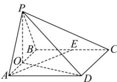
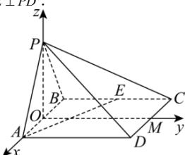

> [!faq]- 全练一本通解析
> **【答案】** （1）证明见解析（2） $\left(\frac{\sqrt{5}}{5},\frac{\sqrt{15}}{5}\right)$
>
> **【解析】**
> （1）
> 
> 如图, 取线段 AB 的中点 O, 连接 PO, OD.
> 因 PA = PB，则 $PO \perp AB$ ，又平面 $PAB \perp$ 平面 ABCD，平面 $PAB \cap$ 平面 $ABCD = AB, PO \subset$ 平面 PAB，
> 故 $PO \perp$ 平面 ABCD，因 $AE \subset$ 平面 ABCD，
> 则 $PO \perp AE$ ①
> 在正方形 ABCD 中，E 为 BC 的中点，易证 $Rt_{\triangle ABE} \cong Rt_{\triangle DAO}$ 故得： $\angle BAE = \angle ODA$ ，则 $\angle BAE + \angle AOD = 90^{\circ}$ ，即得： $OD \perp AE$ ②
> 因 $OD \cap OP = O, OD, PO \subset$ 平面 POD，
> 则 $AE \perp$ 平面 POD，因 $PD \subset$ 平面 POD，
> 故 $AE \perp PD$ .
> 
> (2)
> 取 $CD$ 中点 $M$ ，连接 $OM$ ，分别以 $\overrightarrow{OA},\overrightarrow{OM},\overrightarrow{OP}$ 为 $x,y,z$ 轴的正方向，建立空间直角坐标系.取正方形边长为 $2a$ ，高 $OP = h$ ，因 $\triangle APB$ 为锐角三角形，故 $\angle APB$ 必为锐角，
> 由余弦定理， $\cos \angle APB = \frac{\left(\sqrt{h^2 + a^2}\right)^2 + \left(\sqrt{h^2 + a^2}\right)^2 - 4a^2}{2\left(\sqrt{h^2 + a^2}\right)^2} = \frac{h^2 - a^2}{h^2 + a^2}\in (0,1)$
> 解得：h > a .
> 依题意， $A(a,0,0),D(a,2a,0),P(0,0,h),E(-a,a,0)$
> 则 $\overrightarrow{AE} = (-2a, a, 0), \overrightarrow{AD} = (0, 2a, 0), \overrightarrow{AP} = (-a, 0, h)$ ,
> 设平面 PAD 的法向量为 $\vec{n}=(x,y,z)$ ，则 $\left\{\begin{aligned}\vec{n}\cdot\overrightarrow{AD}&=2ay=0\\\vec{n}\cdot\overrightarrow{AP}&=-ax+hz=0\end{aligned}\right.$ ，可取 $\vec{n}=(h,0,a)$ .
> 设线 $AE$ 与平面 $PAD$ 所成角为 $\theta$ ，则 $\sin \theta = |\cos \langle \overrightarrow{AE},\vec{n}\rangle | = |\frac{-2h}{\sqrt{5}\times\sqrt{h^2+a^2}}|$ ，则 $\cos \theta = \sqrt{1 - \frac{4h^2}{5(h^2 + a^2)}} = \frac{\sqrt{5}}{5}\sqrt{1 + \frac{4a^2}{h^2 + a^2}}$
> 因 $h > a$ ，故 $\frac{\sqrt{5}}{5} <  \cos \theta <  \frac{\sqrt{15}}{5}$
> 即直线 $AE$ 与平面 $PAD$ 所成角的余弦值的取值范围为 $(\frac{\sqrt{5}}{5}, \frac{\sqrt{15}}{5})$
