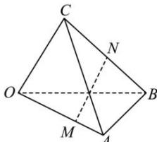

<!-- question-source:start -->
【11】（2023·全国高二专题）如图,在空间四边形OABC中， $\overrightarrow{OA}=\vec{a}$ ， $\overrightarrow{OB}=\vec{b}$ ， $\overrightarrow{OC}=\vec{c}$ ，且OM=2MA，BN=NC，则 $\overrightarrow{MN}$ 等于（）

A. $\frac{2}{3}\vec{a} +\frac{2}{3}\vec{b} +\frac{1}{2}\vec{c}$ B. $\frac{1}{2}\vec{a} +\frac{1}{2}\vec{b} -\frac{1}{2}\vec{c}$ C. $-\frac{2}{3}\vec{a} +\frac{1}{2}\vec{b} +\frac{1}{2}\vec{c}$ D. $\frac{1}{2}\vec{a} -\frac{2}{3}\vec{b} +\frac{1}{2}\vec{c}$
<!-- question-source:end -->

![[Q00005378A1]]
