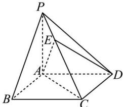

<!-- question-source:start -->
【12】（2023·全国高二专题）数学名著《九章算术》中，将底面为矩形且一侧棱垂直于底面的四棱锥称为阳马。如图，四棱锥 P-ABCD 为阳马， $PA \perp$ 平面 ABCD，且 EC = 2PE，若 $\overrightarrow{DE} = x\overrightarrow{AB} + y\overrightarrow{AC} + z\overrightarrow{AP}$ ，则 $x + y + z = (\quad)$

A. 1 B. 2 C. $\frac{1}{3}$ D. $\frac{5}{3}$
<!-- question-source:end -->

![[Q00005379A1]]
