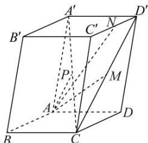

<!-- question-source:start -->
【9】（2024·全国高二课后作业）如图,在平行六面体 $ABCD-A'B'C'D'$ 中， $\overrightarrow{AB}=\vec{a}$ ， $\overrightarrow{AD}=\vec{b}$ ， $\overrightarrow{AA'}=\vec{c}$ ，P 是 $CA'$ 的中点，M 是 $CD'$ 的中点，N 是 $C'D'$ 的中点，用基底 $\left\{\vec{a},\vec{b},\vec{c}\right\}$ 表示以下向量：

(1) $\overrightarrow{AP}$ ;
(2) $\overrightarrow{AM}$ ;
(3) $\overrightarrow{AN}$ .
<!-- question-source:end -->

![[Q00005623A1]]
