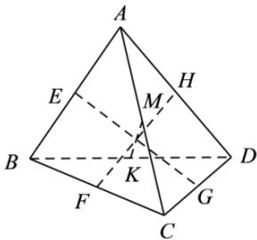

<!-- question-source:start -->
【23】如图, 四面体 ABCD, E, F, G, H, K, M, 分别为棱 AB, BC, CD, DA, BD, AC 的中点, 且 $\left|EG\right|=\left|FH\right|=\left|KM\right|$ , 利用空间向量证明 $AB \perp CD$ , $AC \perp BD$ , $AD \perp BC$ .

<!-- question-source:end -->

![[Q00005390A1]]
