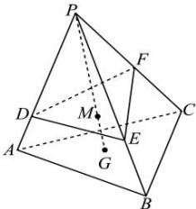

<!-- question-source:start -->
【30】如图, 在三棱锥 P-ABC 中, 点 G 为 $\triangle ABC$ 的重心, 点 M 在 PG 上, 且 PM = 3MG, 过点 M 任意作一个平面分别交棱 PA, PB, PC 于点 D, E, F, 若 $\overrightarrow{PD} = m\overrightarrow{PA}, \overrightarrow{PE} = n\overrightarrow{PB}, \overrightarrow{PF} = t\overrightarrow{PC}$ , 求证: $\frac{1}{m} + \frac{1}{n} + \frac{1}{t}$ 为定值.

<!-- question-source:end -->

![[Q00005397A1]]
