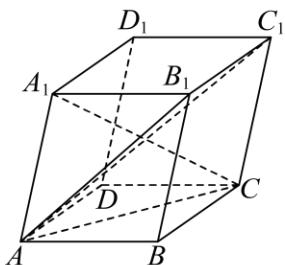

<!-- question-source:start -->
【4】（2023·全国高二课堂例题）如图,在平行六面体 $ABCD-A_{1}B_{1}C_{1}D_{1}$ 中,可以作为空间向量的一个基底的是（）

A. $\overrightarrow{AB}$ ， $\overrightarrow{AC}$ ， $\overrightarrow{AD}$ B. $\overrightarrow{AB}$ ， $\overrightarrow{AA_1}$ ， $\overrightarrow{AB_1}$ C. $\overrightarrow{D_1A_1}$ ， $\overrightarrow{D_1C_1}$ ， $\overrightarrow{D_1D}$ D. $\overrightarrow{AC_1}$ ， $\overrightarrow{A_1C}$ ， $\overrightarrow{CC_1}$
<!-- question-source:end -->

![[Q00005371A1]]
